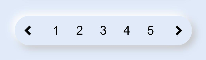

# Neumorphism_Pagination

# Installation :

1. Copy the neumorph_pagination folder in your repo.
2. Add neumorphism as a dependency in your package.json file.

```json
{
  "dependencies": {
    "neumorphism": "file:../neumorph_pagination"
  }
}
```

# Note :

Add this css snippet when passing input or button through slot .

```css
button, input{
    width: 100%;
    height: 100%;
    background-color:transparent;
    text-color: black;
}
```

# Pagination



Import:
```html
<element name='neupagination' src='../../../../../../node_modules/neumorphism/pagination/pagination.hml'></element>
```

Usage:
```html
<neupagination color="" width="300px" height="50px" border="50px"  @previous-event="previousEvent" @next-event="nextEvent">
  <button>1</button>
  <button>2</button>
  <button>3</button>
  <button>4</button>
  <button>5</button>
</neupagination>
```
